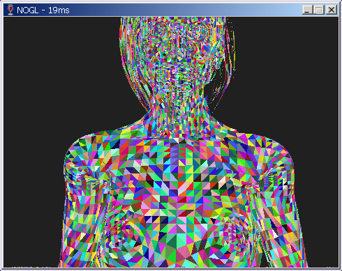

# No Graphics Library
Idk really if it will be a library or a standalone.\
It is forked from OMGL, I hate OpenGL as of now, so I decided to split paths with it and replace it with NO GRAPHICS LIBRARY!

# Note to future me
Hello there, `XMM`, `YMM` and `Q4` are where you left off, `Q4` is half-baked, the design of `XMM` and `YMM` is too boilerplate and changes in one usually *require* changes in the other. You left off at implementing rotation, `VOV4::Rotate()` exists, but the whole math library is kind of not very well designed. Other than that it's pretty much is a good design, Minion-Wizard design might benefit from more small changes perhaps, but overall it's OK.\
A reminder of what I learnt:\
- How to parse JSONs in a very neat way.
- How to parse glb, not very hard after JSON parsing is done, just a matter of traversing the bullshit glTF spec has.
- How to use many SIMD stuff on x86(x64 to be exact), SSE4, AVX2, sadly no AVX512 because nothing older than 5 years seems to support it.
- Rust isn't that bad.
- Multi-threading is not scary, but can be a pain.
- libstd++ isn't that bad.
- Good foundation is key in big projects.
- Cross compiling is a pain.

# Current state
As of 2024-09-29, cool colors lol, performance went down because of that but it's temporary anyway.\


# Roadmap(TODO)
- [x] Basics.
  - [x] Pushing the project.(I want something to be ticked lol)
  - [x] Set up a performant Window.
  - [x] Setting up the basics.
  - [x] Basic loop.
- [x] Synchronization primitives
  - [x] Thread objects.
  - [x] Atomic objects(basics, not everything).
  - [x] Fast mutex objects.
  - [x] Event based objects(Bells).
- [ ] Math utilities. (Ongoing)
  - [x] Understand SIMD enough to use it.
  - [x] Play around with SIMD and prototype stuff for the below step.
  - [x] Vector math, using SIMD and bulk computation of vectors. The idea is a VOV(Vector Of Vectors) object.
  - [x] Matrix math for perspective projection.
  - [x] Various vector arithmetic using SIMD: normalization, dot, cross, etc.
  - [x] Refector hot functions like multiplication with matrices for multi-thread support.
  - [x] Create SIMD primitives like XMM and YMM.
  - [x] Integrate XMM and YMM into the math utility.
  - [ ] Polish up.
- [ ] Multi-threading.
  - [x] Minions, split work between each other, like multiplying VOVs.
  - [ ] Polish up.
- [ ] Loading models(glTF format(.glb only for now))
  - [x] Refer to [glTF](https://registry.khronos.org/glTF/specs/2.0/glTF-2.0.html) for docs(Ongoing).
  - [x] Make a JSON parser, integral part of glTF.
  - [x] Look for any leaks and stuff in the JSON parser.
  - [x] Bare bones load models into a Scene object using utilities I made.
  - [x] Load camera info into the Scene too or at least implement logic for cameras.
  - [x] Make a PNG parser, I ain't dealing with it myself so with libpng.
  - [ ] Texture support, TEXCOORDS_n and shii.
  - [ ] Optional - Add support for glTF text version.
- [ ] Rendering.
  - [x] Projecting model's vertices into screen space(Very optimized because screen space scaling is in the projection matrix!).
  - [x] Rendering vertices themselves.
  - [x] Rendering triangles, basic incremental half-spaced method.
  - [x] Advanced block based triangle rendering.
  - [ ] Rotating with quaternions!
- [ ] Advanced shading to prepare for next step.
  - [ ] Specular highlighting.
  - [ ] Metallic shaders.
  - [ ] Sheen.
  - [ ] Sub-surface scattering, a cool one.
  - [ ] Understand and tackle some PBR.
- [ ] Writing shaders for more complex maps. WITH PBR!
  - [ ] Good ol' bump maps.
  - [ ] Normal maps.
  - [ ] Specular maps.
  - [ ] The rest of the stuff.
- [ ] Post processing.
  - [ ] Rendering to a texture.
  - [ ] Applying simple anti-aliasing.
  - [ ] Bloom.
  - [ ] Film, or just general grain.
  - [ ] Palettizing.
- [ ] Rigging.
- [ ] Animation?
- [ ] Extras.
  - [ ] Implement for Linux, not that complex.
  - [ ] Font rendering. For now monospaced.
  - [ ] Using the new font renderer to render useful info.

# Basic making
Your usual:
```sh
mkdir build
cd build
cmake -DCMAKE_BUILD_TYPE=Release ..
make
nogl
```

# Making on Linux for Windows
use `cmake` with the `toolchains/unix-win32.cmake` toolchain. In a nutshell:
```sh
mkdir build
cd build
cmake -DCMAKE_TOOLCHAIN_FILE=toolchains/unix-win32.cmake -DCMAKE_BUILD_TYPE=Release ..
make
wine nogl.exe
```
